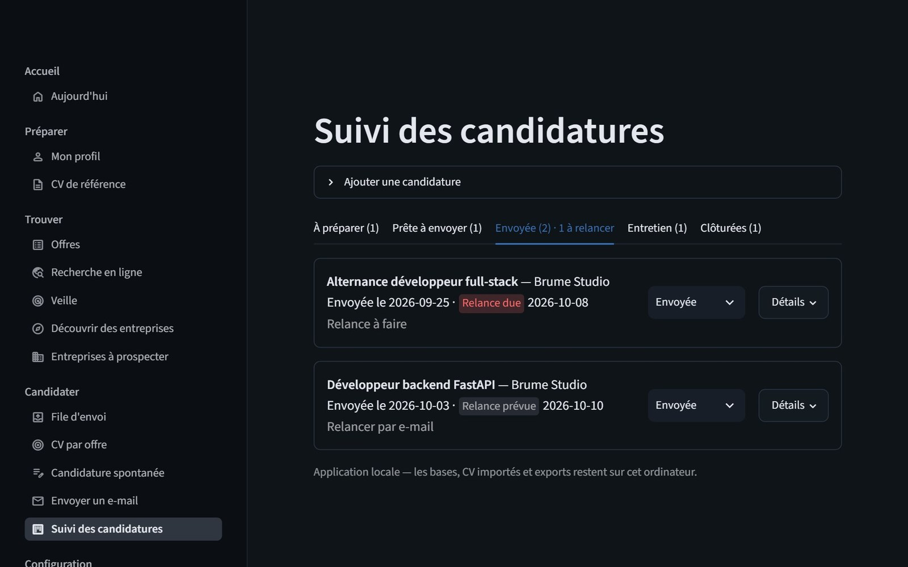
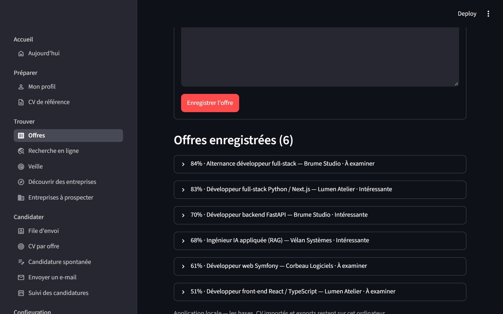
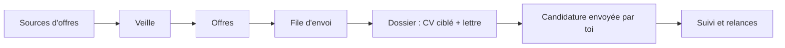

# Assistant candidatures

[](https://github.com/TeddyRhim/assistant-candidature/actions/workflows/ci.yml)
[](LICENSE)

Application locale pour organiser une recherche d'emploi de développeur : collecter des offres, les comparer à un profil et préparer des candidatures adaptées à partir d'un CV de référence.

Tout reste sur la machine : base SQLite, CV, lettres et exports. Rien n'est envoyé automatiquement.

## Aperçu

Captures réalisées avec un profil et des offres d'exemple (aucune donnée personnelle), dans le thème sombre de l'application.

| Suivi des candidatures | Offre classée par correspondance, détail du calcul |
| --- | --- |
|  |  |



| Étape | Page | Ce qu'elle fait |
| --- | --- | --- |
| Préparer | Mon profil, CV de référence | Profil de recherche et CV de départ, saisis et gardés en local |
| Trouver | Offres, Recherche en ligne, Veille | Collecte d'annonces, import, comparatif avec le profil |
| Trouver | Découvrir des entreprises, Entreprises à prospecter | Pistes d'entreprises pour des candidatures spontanées |
| Candidater | File d'envoi, CV par offre, Candidature spontanée | Dossier prêt à envoyer : CV ciblé et lettre en PDF |
| Candidater | Envoyer un e-mail | Envoi individuel, toujours confirmé à la main |
| Suivre | Suivi des candidatures | Un onglet par statut, relances à échéance |
| Configurer | Réglages | État des clés des sources et test de connexion |

## Principes

- Les données et documents restent sur la machine.
- Le CV adapté reste fidèle au parcours réel : l'outil aide à reformuler et à prioriser, il n'invente rien.
- Les indications de correspondance aident à choisir, elles ne promettent aucun résultat.
- Les annonces et contacts viennent de sources autorisées (API officielles ou publiques).
- Aucune candidature n'est envoyée automatiquement : tu postules toi-même, puis tu l'enregistres.

## Démarrer

Prérequis : Python 3.11 ou plus et [`uv`](https://docs.astral.sh/uv/).

```powershell
uv sync
uv run streamlit run src/app.py
```

L'interface s'ouvre dans le navigateur, en local. Au premier lancement, renseigne ton profil dans **Mon profil** et importe ton CV dans **CV de référence** (PDF textuel ou DOCX).

### Configuration locale

Rien de personnel n'est versionné. Ces fichiers restent sur ta machine et sont ignorés par git :

| Fichier | Contenu |
| --- | --- |
| `.streamlit/secrets.toml` | Clés des sources (Adzuna, France Travail, Mailjet en option) |
| `data/` | Base SQLite, CV importés, réglages de la veille, journaux |
| `data/watcher_config.json` | Réglages de la veille : zones, mots exclus, seuil (modifiables dans la page **Veille**) |

La page **Réglages** indique quelles clés sont présentes, sans jamais les afficher.

## Sources d'offres

| Source | Accès |
| --- | --- |
| Adzuna | API avec clés |
| France Travail | API officielle avec compte |
| Jooble | Agrégateur d'offres (clé gratuite, quota limité : le nombre de requêtes est compté et plafonné) |
| Himalayas et Remote OK | API publiques d'offres en télétravail, sans clé (le lien et le nom de la source sont conservés) |
| Greenhouse et Lever | API publiques des pages carrières d'entreprises |
| La Bonne Boîte et registre public | Découverte d'entreprises |

Détails, limites et conditions d'usage : [docs/job-sources.md](docs/job-sources.md).

## Lancer la veille

Depuis l'interface, le bouton **Récupérer les annonces et préparer les dossiers** de la page **Veille** collecte les offres puis prépare les dossiers. La même opération existe en ligne de commande :

```powershell
uv run python -m src.cli daily
```

Une tâche planifiée Windows est possible mais facultative : voir `scripts/install_daily_task.ps1`.

## Générateur de CV autonome

```powershell
uv run python render.py                      # data/cv_base.json -> output/cv.pdf
uv run python render.py data/autre.json output/autre.pdf
```

Le rendu utilise Jinja2 et WeasyPrint. Sous Windows, WeasyPrint demande les bibliothèques GTK3/Pango ; définis `WEASYPRINT_DLL_DIRECTORIES` si elles ne sont pas détectées. Un exemple de données est fourni dans `data/cv_base.json.example`.

## Développement

```powershell
uv run pytest        # tests
uv run ruff check .  # style
```

## Documentation

- [Spécifications](docs/specifications.md)
- [Architecture](docs/architecture.md)
- [Sources d'offres](docs/job-sources.md)
- [Feuille de route](docs/roadmap.md)

## Licence

Projet distribué sous licence [MIT](LICENSE).
